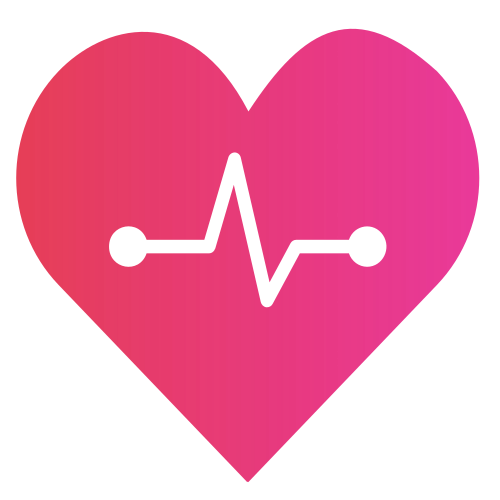
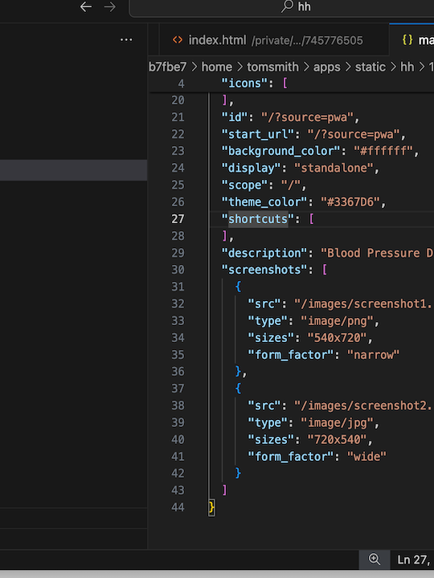

# Hypertension Helper

This Progressive Web App (PWA) is meant to be a tool with which you can record, your personal details and also multiple blood pressure readings in a diary.

The idea is that a person might install the app, record their blood pressure over a period of time, then share that informttion by downloading their data as a CSV file and sharing that with a doctor when in clinic.

It is designed to NOT rely on the internet (except for installation, and emailing the doctor your data of course), and stores all of its data in LocalStorage. 

It is designed, I hope, to be usable on really old smart phones, and to allow for multiple people to be able to keep their data on this same phone, each person having a separate profile (these aren't passworded or anything, you choose your profile from a dropdown).

## Intelligent Medical Information?

This medical information is presented differently to the user based on their personal health information and latest blood pressure reading. So for example, if a person's weight, ethnicity or age suggests some treatment, then that information will be promoted or highlighted to the user.

#### How This App Works

This feature is provided by the medical information being authored in a tool called Twine, which the app passes personal data to via the URL's search args and they become twine variables.

## Installing The App Yourself

The [Hypertension Helper](https://static.everythingability.opalstacked.com/hh/) app is available here. Remember, any data you add is only stored in that browser window. It is saved if you close the window, but won't be available on another device. No data is stored or saved online.

## About This Project

This project is made by Tom Smith, and was inspired by working with Yomi Sanusi and will be based on information from The World Health Organization (WHO) and more importantly, the work of the National Institute for Health and Care Excellence (NICE) https://www.nice.org.uk/guidance/NG136 

Yomi informs me that thousands more Africans die every year from hypertension, in way Europeans or Americans don't, simply from lack of information and guidance about high blood pressure, and he thought if this app was made then it might help to saving those peoples lives.

At present, the "intelligent medical information" part works as proof of concept, but hasn't been fulling implemented yet.

This is a work in progress at the moment. I have no idea if I have the skills to make this work.

