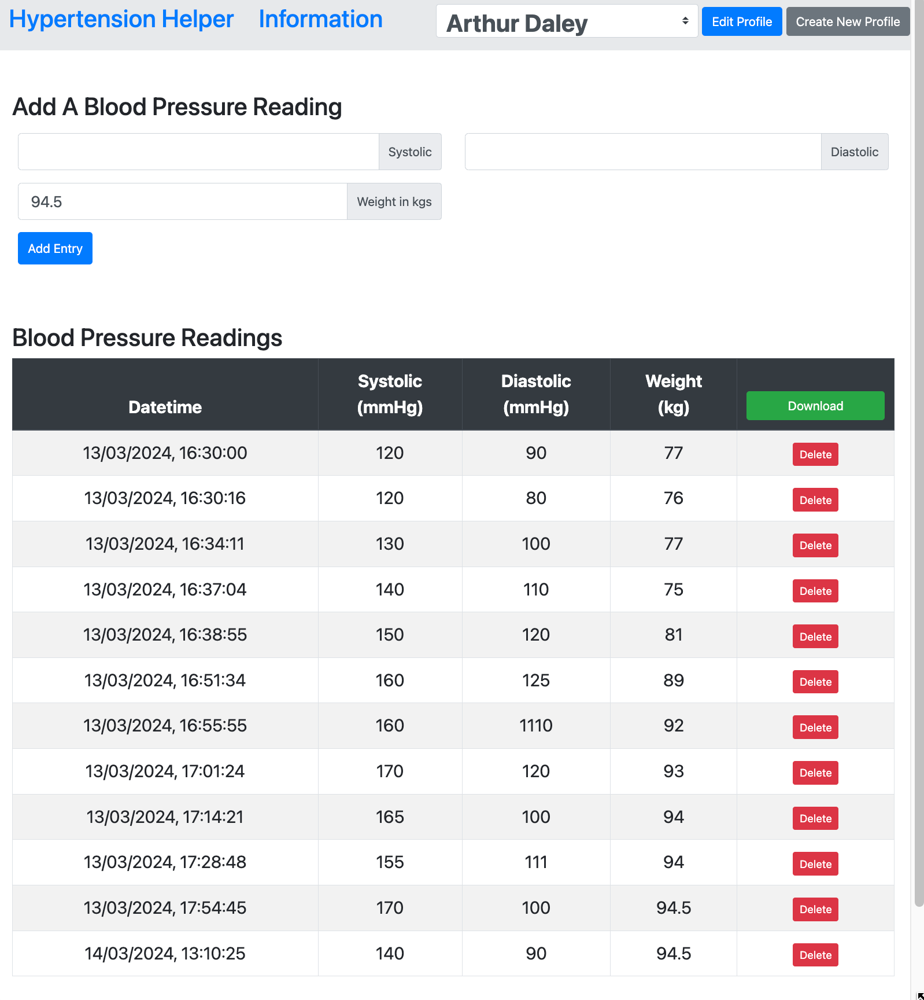

# Hypertension Helper

This Progressive Web App (PWA) is meant to be a tool with which you can record, your personal details and also multiple blood pressure readings in a diary.

The idea is that a person might install the app, record their blood pressure over a period of time, then share that informttion by downloading their data as a CSV file and sharing that with a doctor when in clinic.

It is designed to NOT rely on the internet (except for installation, and emailing the doctor your data of course), and stores all of its data in LocalStorage. 

## Intelligent Medical Information?

This medical information is presented differently to the user based on their personal health information and latest blood pressure reading. So for example, if a person's weight, ethnicity or age suggests some treatment, then that information will be promoted or highlighted to the user.

#### How This App Works

This feature is provided by the medical information being authored in a tool called Twine, which the app passes personal data to via the URL's search args and they become twine variables.

## About This Project

This project is made by Tom Smith, and was inspired by working with Yomi Sanusi and will be based on information from The World Health Organization (WHO) and more importantly, the work of the National Institute for Health and Care Excellence (NICE) https://www.nice.org.uk/guidance/NG136 

At present, the "intelligent medical information" part works as proof of concept, but hasn't been fulling implemented yet.

This is a work in progress at the moment.

